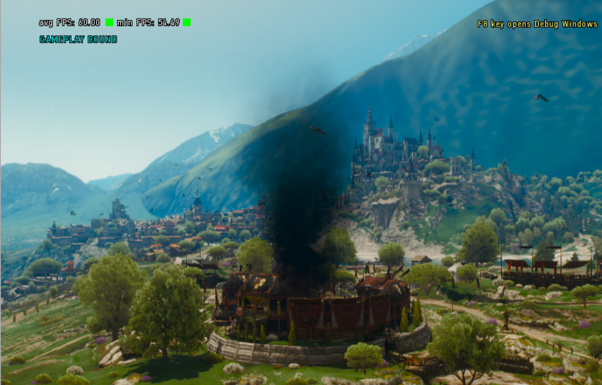
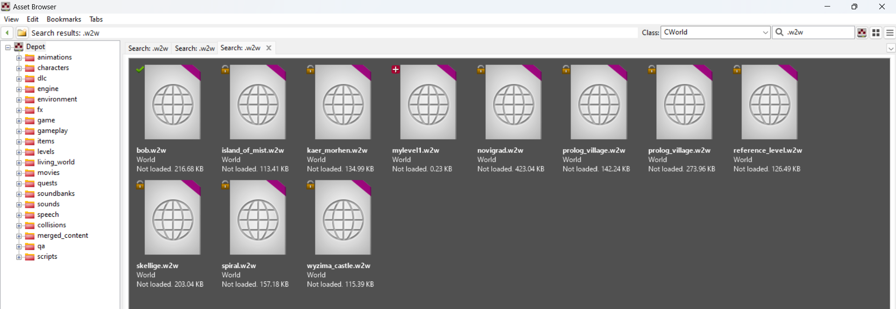
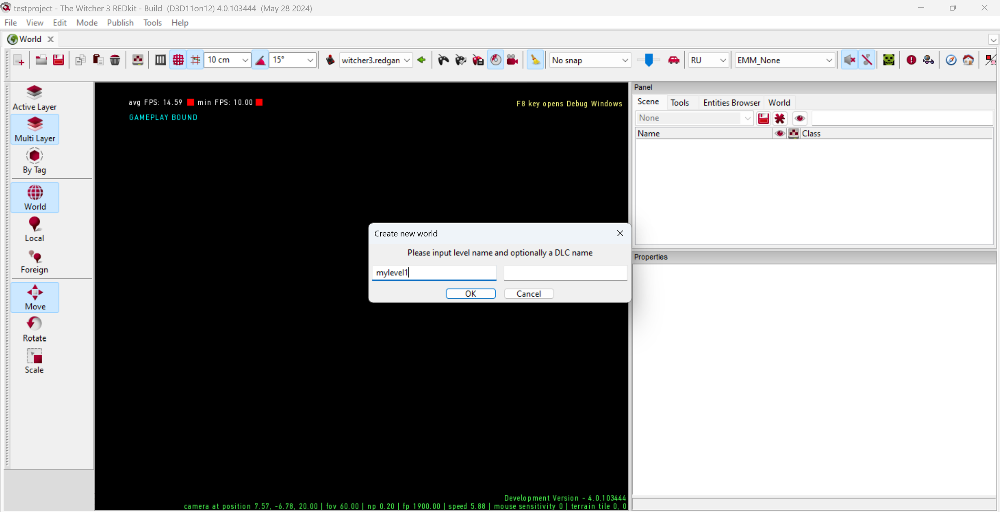
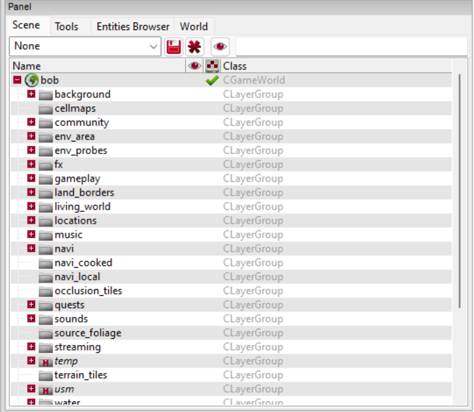
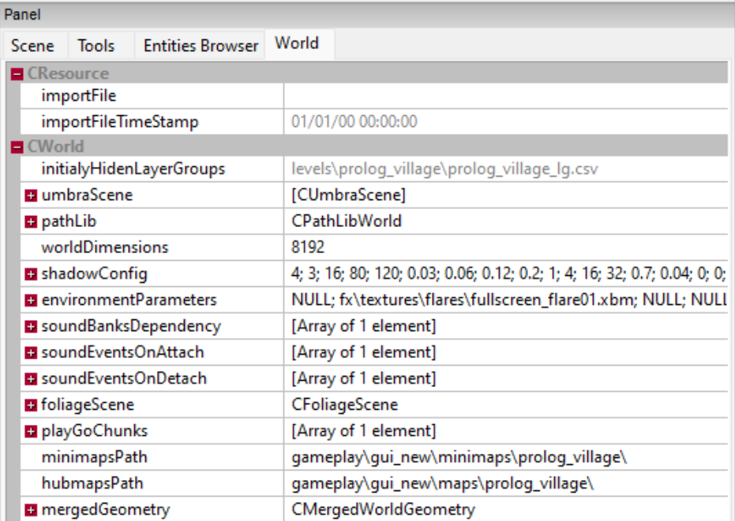

# World
World (далее **Мир**) - это центральная сущность проекта REDkit и одновременно главная сцена игрового уровня.

Согласно концепции Witcher 3, **Миры** разделяют игру на зоны интереса и реализует отдельные участки глобальной карты.
В рамках **Мира** размещаются элементы ландшафта, игровые объекты, триггеры, скрипты и прочие элементы взаимодействия с игроком.

К имеющимся игровым мирам можно отнести деревню из пролога, Новиград, Скеллиге и прочие.

<figure><figcaption></figcaption></figure>

## Приступая к работе
Для начала работы потребуется загрузить имеющийся или или создать собственный **Мир**.

Так как наилучшим способом знакомства с мирами в рамках работы в REDkit, является изучение готовых миров в первую очередь рассмотрим способы поиска и открытия уже имеющихся игровых миров.

## Загрузка мира
Для открытия игрового **Мира** потребуется найти один из файлов формата W2W в браузере ассетов (Asset Browser).

Несмотря на то, что большая часть миров расположена в ожидаемых местах (например папка "levels"), самым быстрым и эффективным способом найти нужный мир будет использование встроенного поиска.

Для это окне "Class:" выберете тип "CWorld", а окне поиска укажите ".w2w". Убедитесь, что выбран режим поиска по всей библиотеке и нажмите Enter.

<figure><figcaption></figcaption></figure>

В результате поиска вы сможете увидеть все имеющиеся игровые миры, в том числе и созданные вами. Для открытия мира нажмите Enter или двойной щелчок левой кнопкой мыши.


*Если, вам необходимо найти расположение найденного файла, то вы можете нажать правую кнопку мыши по файлу и выбрать "Go to resource home"*



*Подробнее о работе с браузером ассетов (Asset Browser) [тут](/editor/asset-browser)*


## Создание мира
В случае, если вы уже готовы приступить созданию собственного мира, то сделать это очень легко. Для этого в главном выберете меню "File > New World" и в открывшемся окне укажите имя вашего игрового **Мира**.

**Важно!** В рамках структуры Witcher 3 существует разделение на основную (ванильную) игру и DLC. Если вы разрабатываете мод, интегрируемый в текущую игру, то пространство создания игрового **Мира** не имеет значения, однако для самостоятельного DLC доступного из главного меню, требуется указать имя мира в поле "DLC name"


<figure><figcaption></figcaption></figure>

В зависимости от того, указали ли вы имя DLC или нет, будет определено расположение основного каталога для вашего мира. Для обычного мира в папке "levels" будет создана папка с именем вашего мира и в ней одноименный файл формата W2W.

Если же вы укажете имя и в поле DLC, то папка с таким именем будет создана в каталоге "dlc", а сам фал мира будет называться согласно имени из первого поля ввода.

## Работа с миром
### Слои (Scene)
<figure><figcaption></figcaption></figure>

Загруженный **Мир** представляет из себя структуру каталогов, содержащих слои с игровыми сущностями.

Каталоги являются логической группировкой для других каталогов и слоев в них. Например группа "fx" содержит слои со всеми визуальными эффектами используемыми на уровне.

Слой в свою очередь объединяет основные игровые элементы, такие как мэшы, пути, триггеры, зоны и пр. Подробнее о слоях и особенностях работы с ними [тут](/gameplay/sloi)


Имена папок и слоев не носят обязательный характер и выбраны такими, чтобы правильно отражать задачу, которую они решают. Рекомендуется следовать этому шаблону и именовать свои папки/слои по примеру готовых **Миров** игры.


### Tools
Большая часть инструментов, которые вам понадобятся для наполнения вашего **Мира** расположены во вкладке "Tools". Например для создания рельефа потребуется инструмент "Terrain Edit Tools", а для тестирования анимаций для разных NPC в рамках вашего **Мира**, поможет инструмент "Test Anim".

Однако прежде чем приступить к созданию/редактированию ландшафта, а так же размещению новых объектов на слоях, необходимо настроить глобальные свойства мира.

### Свойства мира
Настройки **Мира** находятся на вкладке "World" в панели управления и представляют собой глобальные свойства применяемые к миру.

<figure><figcaption></figcaption></figure>

Рассмотрим эти свойства подробнее:
<table>
    <thead>
        <tr>
            <th width="202">Свойство</th>
            <th>Описание</th>
        </tr>
    </thead>
    <tbody>
        <tr>
            <td><b>importFile</b></td>
            <td>Путь к фалу мира во внешнем источнике. Используется для импорта миров, созданных или измененных вне редактора REDKit. В рамках большинства ситуаций использоваться не будет.</td>
        </tr>
        <tr>
            <td><b>importFileTimeStamp</b></td>
            <td>Время последнего изменения (загрузки) внешнего файла мира.</td>
        </tr>
        <tr>
            <td><b>initialyHiddenLayerGroups</b></td>
            <td>Ссылка на внутренний файл с информацией о слоях, которые не будут загружены на старте <b>мира</b>. Такие слои обычно используются для отображения изменений мира в ходе игрового процесса.</td>
        </tr>
        <tr>
            <td><b>umbraScene</b></td>
            <td>Набор свойств отвечающих за окклюзию окружения. Подробнее об окклюзии <a href="https://ru.wikipedia.org/wiki/%D0%9E%D0%BA%D1%80%D1%83%D0%B6%D0%B0%D1%8E%D1%89%D0%B5%D0%B5_%D0%B7%D0%B0%D1%82%D0%B5%D0%BD%D0%B5%D0%BD%D0%B8%D0%B5">тут</a>.</td>
        </tr>
        <tr>
            <td><i>- distanceMultiplier</i></td>
            <td>Множитель для расстояния стриминга окклюзии.</td>
        </tr>
        <tr>
            <td><i>- distanceMultiplier</i></td>
            <td>Ссылка на карту с зонами распределения окклюзии.</td>
        </tr>
        <tr>
            <td><b>pathLib</b></td>
            <td>Перечень настроек расчета навигации. <i>Ряд настроек имеют продвинутый характер и не меняются при работе с большинством <b>миров</b>, поэтому они будут опущены.</i></td>
        </tr>
        <tr>
            <td><i>- globalSettings</i></td>
            <td>Группа свойств.</td>
        </tr>
        <tr>
            <td><i>-- roadsNavcostMultiplier</i></td>
            <td>Множитель стоимости навигации по дорогам. Простыми словами это коэффициент затрат на расчет навигации по дороге. Чем выше коэффициент, тем точнее расчет навигации, но ниже производительность.</td>
        </tr>
        <tr>
            <td><i>-- maxTerrainSlope</i></td>
            <td>Максимальный уклон рельефа. Используется для расчетов навигации по рельефу.</td>
        </tr>
        <tr>
            <td><i>-- seaLevel</i></td>
            <td>Уровень моря. Все, что ниже этого уровня будет считаться непроходимым и не будет участвовать в расчете навигации. <i>Не указывайте 0, если требуется расчет навигации по мелководью на береговой линии</i>.</td>
        </tr>
        <tr>
            <td><i>-- desiredStreamingRange</i></td>
            <td>Диапазон, в котором мы хотим, чтобы все навигационные данные передавались в потоковом режиме.</td>
        </tr>
        <tr>
            <td><i>-- terrainWalkableRegionMinSize</i></td>
            <td>Минимальный размер зоны, по которой можно пройти на пересеченной местности (в метрах квадратных).</td>
        </tr>
        <tr>
            <td><i>-- terrainUnWalkableRegionMinSize</i></td>
            <td>Минимальный размер участка, по которому невозможно пройти (в метрах квадратных).</td>
        </tr>
        <tr>
            <td><i>-- terrainHeightApproximationRange</i></td>
            <td>Максимальная погрешность аппроксимации (подробнее о термине <a href="https://ru.wikipedia.org/wiki/%D0%90%D0%BF%D0%BF%D1%80%D0%BE%D0%BA%D1%81%D0%B8%D0%BC%D0%B0%D1%86%D0%B8%D1%8F">тут</a>). Меньшая точность - больше проблем, особенно с npc.</td>
        </tr>
        <tr>
            <td><b>worldDimensions</b></td>
            <td>Размер мира.</td>
        </tr>
        <tr>
            <td><b>shadowConfig</b></td>
            <td>Настройки теней в рамках <b>мира</b>. <i>Большая часть настроек имеют продвинутый характер и не меняются при работе с большинством <b>миров</b>, поэтому они будут опущены</i>.</td>
        </tr>
        <tr>
            <td><i>- useTerrainShadows</i></td>
            <td>Активировать глобальные тени.</td>
        </tr>
        <tr>
            <td><i>- terrainShadowsDistance</i></td>
            <td>Дистанция отрисовки глобальных теней.</td>
        </tr>
        <tr>
            <td><i>- terrainShadowsFadeRange</i></td>
            <td>Диапазон, на котором исчезают тени местности.</td>
        </tr>
        <tr>
            <td><i>- terrainShadowsBaseSmoothing</i></td>
            <td>Базовое сглаживание для теней.</td>
        </tr>
        <tr>
            <td><i>- terrainShadowsTerrainDistanceSmoothing</i></td>
            <td>Дистанция на которой сглаживаются тени мира.</td>
        </tr>
        <tr>
            <td><i>- terrainShadowsMeshDistanceSmoothing</i></td>
            <td>Дистанция на которой сглаживаются тени объектов (мешей).</td>
        </tr>
        <tr>
            <td><i>- terrainShadowMeshDistance</i></td>
            <td>Дистанция на которой отбрасываются тени объектов (мешей).</td>
        </tr>
        <tr>
            <td><i>- terrainShadowMeshFadeRange</i></td>
            <td>Диапазон затухания теней объектов (мешей).</td>
        </tr>
        <tr>
            <td><b>environmentParameters</b></td>
            <td>Настройки окружения</td>
        </tr>
        <tr>
            <td><i>- vignetteTexture</i></td>
            <td>Текстура виньетирования (размытия по краям экрана в разных игровых ситуациях).</td>
        </tr>
        <tr>
            <td><i>- cameraDirtTexture</i></td>
            <td>Текстура грязи на камере.</td>
        </tr>
        <tr>
            <td><i>- interiorFallbackAmbientTexture</i></td>
            <td>Базовая текстура затенения для интерьеров.</td>
        </tr>
        <tr>
            <td><i>- interiorFallbackReflectionTexture</i></td>
            <td>Базовая текстура бликов для интерьеров.</td>
        </tr>
        <tr>
            <td><i>- cameraDirtNumVerticalTiles</i></td>
            <td>Количество вертикальных плиток, загрязнения камеры.</td>
        </tr>
        <tr>
            <td><i>- globalLightingTrajectory</i></td>
            <td>Настройки доля траектории молнии. <i>Это продвинутые настройки, требующие углубленных знаний. Используйте имеющиеся настройки из текущих миров, для достижения желаемого результата</i>.</td>
        </tr>
        <tr>
            <td><i>- environmentDefinition</i></td>
            <td>Настройки окружения в открытом мире (ссылка на файл .env). <i>Этот файл описывает настройки отражающие общий цветокор мира и то как он воспринимается в разное время суток и при разной погоде. Например более тяжелые цвета Каэр Морхена и яркие сочные в Туссенте</i>.</td>
        </tr>
        <tr>
            <td><i>- scenesDirtNumVerticalTiles</i></td>
            <td>Настройки окружения в катсценах (ссылка на файл .env).</td>
        </tr>
        <tr>
            <td><i>- speedTreeParameters</i></td>
            <td>Настройки растительности. <i>Это продвинутые настройки, требующие углубленных знаний. Используйте имеющиеся настройки из текущих миров, для достижения желаемого результата</i>.</td>
        </tr>
        <tr>
            <td><i>- weatherTemplate</i></td>
            <td>Ссылка на файл с шаблонами погоды для <b>мира</b>. Этот файл содержит различные варианты погоды и полные настройки того, как она ведет себя в рамках заданного <b>мира</b>.</td>
        </tr>
        <tr>
            <td><i>- disableWaterShader</i></td>
            <td>Отключить глобальный рендеринг воды. <i>Подробнее глобальной воде и данном свойстве <a href="../level-design/voda.md">тут</a></i>.</td>
        </tr>
        <tr>
            <td><i>- skybox</i></td>
            <td>Параметры неба. <i>Это настройки по-умолчанию для стартового отображения <b>мира</b></i>.</td>
        </tr>
        <tr>
            <td><i>- sunMesh</i></td>
            <td>Ссылка на файл w2mesh содержащий настроенный 3D объект солнца.</td>
        </tr>
        <tr>
            <td><i>- sunMaterial</i></td>
            <td>Класс CMaterialInstance c различными настройками материала для объекта солнца.</td>
        </tr>
        <tr>
            <td><i>- moonMesh</i></td>
            <td>Ссылка на файл w2mesh содержащий настроенный 3D объект луны.</td>
        </tr>
        <tr>
            <td><i>- moonMaterial</i></td>
            <td>Класс CMaterialInstance c различными настройками материала для объекта луны.</td>
        </tr>
        <tr>
            <td><i>-- skyboxMesh</i></td>
            <td>Ссылка на файл w2mesh содержащий настроенный 3D объект небосвода.</td>
        </tr>
        <tr>
            <td><i>-- skyboxMaterial</i></td>
            <td>Класс CMaterialInstance c различными настройками материала для объекта небосвода.</td>
        </tr>
        <tr>
            <td><i>-- cloudsMesh</i></td>
            <td>Ссылка на файл w2mesh содержащий настроенный 3D объект облаков.</td>
        </tr>
        <tr>
            <td><i>-- cloudsMaterial</i></td>
            <td>Класс CMaterialInstance c различными настройками материала для объекта облаков.</td>
        </tr>
        <tr>
            <td><i>- lensFlare</i></td>
            <td>Различные настройки бликов на линзе игровой камеры. <i>Это продвинутые настройки, требующие углубленных знаний. Используйте имеющиеся настройки из текущих миров, для достижения желаемого результата</i>.</td>
        </tr>
        <tr>
            <td><i>- renderSettings</i></td>
            <td>Настройки прорисовки различных элементов <b>мира</b>. <i>Это продвинутые настройки, требующие углубленных знаний. Используйте имеющиеся настройки из текущих миров, для достижения желаемого результата</i>.</td>
        </tr>
        <tr>
            <td><i>- localWindDampers</i></td>
            <td>Ссылка на карту с зонами влияния ветров.</td>
        </tr>
        <tr>
            <td><i>- localWaterVisibility</i></td>
            <td>Ссылка на карту с зонами видимости воды.</td>
        </tr>
        <tr>
            <td><b>soundBanksDependency</b></td>
            <td>Массив ссылок на наборы звуков, которые будут применятся на данном уровне.</td>
        </tr>
        <tr>
            <td><b>soundEventsOnAttach</b></td>
            <td>Массив ссылок на звуковые события при подключении <b>мира</b>.</td>
        </tr>
        <tr>
            <td><b>foliageScene</b></td>
            <td>Класс типа CFoliageScene с настройками поведения листвы в игровых сценах.</td>
        </tr>
        <tr>
            <td><b>minimapsPath</b></td>
            <td>Путь к папке с файлами миникарты. Подробнее о миникартах <a href="../gameplay/mini-map.md">тут</a>.</td>
        </tr>
        <tr>
            <td><b>gubmapsPath</b></td>
            <td>Путь к папке с файлами карты региона.</td>
        </tr>
    </tbody>
</table>

### Итог
Теперь, когда все настроено, вы можете приступать к созданию рельефа и наполнению его объектами и прочем элементами, каждый из которых рассмотрен в прочих разделах руководства.