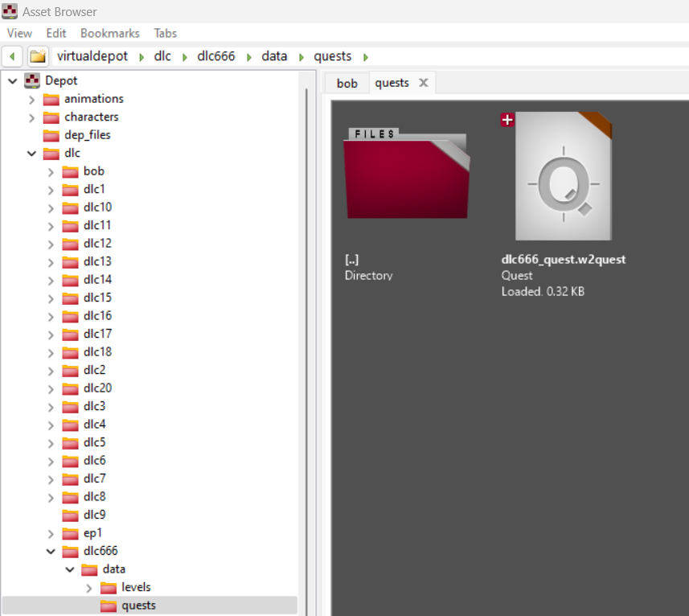

# Добавление основного квеста в проект DLC
Основой сюжетного DLC является файл **квеста**, который вы создадите в рамках своего проекта.


*Не существует жесткого правила по именованию файла и его расположению, однако для избегания потенциальных проблем, рекомендуются следовать структуре и именованию, заданным в проектах dlc от разработчиков.*


## Создание файла квеста
Итак, перейдите в папку вашего DLC и создайте папки так, чтобы они образовывали путь **"dlc > *имя dlc* > data > quests"**.
Внутри созданной папки, нажмите правой кнопкой мыши на пустое место и выберите пункт меню **"Create > Quests"**.
В качестве имени файла используйте **"имяDLC_quest"**.

<figure><figcaption></figcaption></figure>

После создания файла, нужно как минимум добавить стартовую точку внутрь вашего квеста. В противном случае **луч** повествования даже не войдет в ваш файл.
Отройте файл квеста и нажмите правой кнопкой мыши на пустом месте. В открывшемся меню выберите **"Complexity management > Start"**.
Сохраните файл через меню **"File > Save"** или комбинацию клавиш **Ctrl+S** и закройте редактор.


*Подробные описания блоков их свойства и взаимосвязи описаны в разделе [**Описание блоков**](../quests/nodes.md)*


## Начальная настройка
Однако простого создания фала в папке DLC не достаточно, чтобы игра подключила его к повествованию. Для "активации" файла его необходимо указать в настройках DLC в файле ***.reddlc**.


*Описание файла **reddlc** приведено [тут](../gameplay/dlc/dlc-definition.md), а элемент отвечающий за добавление квеста [тут](../gameplay/dlc/dlc-mounters.md)*


<figure><figcaption></figcaption></figure>

## Структура
Теперь когда предварительные действия выполнены, можно приступать к структурированию вашего квеста.
Как и было сказано [ранее](../quests/general.md) полная структура квеста может быть запутанной, поэтому рекомендуется разбивать квест на логические фазы, используя специальный подверсию квеста **Фаза (Phase)**.
Кроме того, на основе имеющийся практики рекомендуется всю корневую структуру так же поместить в файл фазы.

Для этого рядом с файлом квеста создайте файл **.w2phase** с именем "**structure**" (пункт контекстного меню "**Create > Phase**").
Имя файла в данном случае может быть свободным, так как фаза используется только внутри вашего квеста, но старайтесь использовать понятные имена, отражающие задачу фазы.

После создания файла нам так же требуется указать в нем точку входа, через которую **луч** квеста попадет внутрь.
Откройте файл "**structure**" и с помощью контекстного меню "**Complexity management > In**" добавьте входной блок. Сохраните и закройте файл.
Теперь когда фаза создана ее можно добавить в основной файл квеста.

Откройте файл квеста и добавьте блок "**Complexity management > Phase**". Разместите блок фазы справа от блока **Start** и соедините блоки между собой (нажав на черную точку и потянув линию к черной точке другого блока).

После выделите блок фазы и слева в списке укажите в свойство **phase** путь к фалу **structure.w2phase** (выделив нужный файл в Asset Browser, и нажав зеленую стрелочку в окне нужного свойства).

<figure><figcaption></figcaption></figure>


*Не забывайте регулярно сохранять изменения в файлах квеста и фаз. Для быстрого сохранения всех файлов структуры, можно использовать пункт меню **File > Seve all***


Блок **фазы** является своего рода вложением в квест, поэтому вы можете перейти в него с помощью двойного щелчка мыши по блоку фазы. 
Такой маневр называется навигацией внутрь, а двойной щелчок по пустому месту в редакторе осуществит навигацию наружу, что подымет вас на уровень выше (при условии, что вы вошли в файл в редакторе, а не из браузера ассетов).
Вы не ограничены в глубине вложений, поэтому в ваш файл структуры вы можете добавлять другие файлы фаз, а в них другие и т.д. Главное, чтобы внутренняя фаза не содержала в себе ту, что уже есть по дереву выше, иначе это создаст бесконечный цил с последующим падением.

## Пример квеста
Для закрепления понимания работы квеста, давайте выполним простой пример, который покажет, что файл квеста корректно используется игрой.

Откройте файл **structure.w2phase** и справа от блока **In** добавьте блок "**Scripting > Script**".
Соедините блоки линией и выделите блок **Script**. Слева в окне свойств выберите свойство **functionName** и нажмите на красный треугольник.
В открывшемся окне найдите **DisplayHudMessage**. После выбора скрипта в низу блока свойств появится набор свойств, доступных только для этого скрипта. 
В свойстве **localisedStringKey** укажите **"hr101_start"** (значение взято для примера, а вы можете указать любой ключ строки из Localized Strings Editor).

Теперь в REDkit запустите сохраненную игру (или используя шаблон **.redgame**) и при появлении игрока вы увидите ваше сообщение.

<figure><figcaption></figcaption></figure>


*Если сообщение не отображается, главной причиной может быть недостаточная настройка файла **reddlc**. Для того, чтобы игра не проигнорировала этот файл он должен содержать Id и ключи локализации для названия и описания DLC. Это минимальное требования для подключения DLC к игре.*


# Послесловие
На последок еще раз стоит напомнить о концепции **луча**, которая используется игрой для отслеживания прогресса.
На основе простого примера выше можно нарисовать картину происходящего:

- При запуске игры, загружаются все имеющиеся файлы квестов, указанных в настройках всех найденных  файлов **reddlc**.
- **Луч** попадает в ваш файл квеста и следует от блока **Start** по всем имеющимся направлениям. Если **луч** попадает в блок фазы, то он заходит внутрь и так же расходится по всем линиям от блока **In**.
- Встречая на пути блок, **луч** выполняет его или ждет выполнения условия (если это условный блок).
- Выполнив блок, **луч** следует дальше, если этот блок соединен еще с чем то.
- При сохранении игры, будет сохранено положение **луча** в текущий момент времени.
- Если загрузить игру впервые, то пример выше, выведет сообщение, **луч** достигнет конца квеста и это положение попадет в следующее сохранение.
- Если загрузить игру из нового сохранения, то ничего не произойдет, так как положение **луча** за пределами блока сообщения. Помните это при отладке квестов, в идеале имея сохранение до начала основного квеста и отдельные сохранения в важных точках его выполнения.