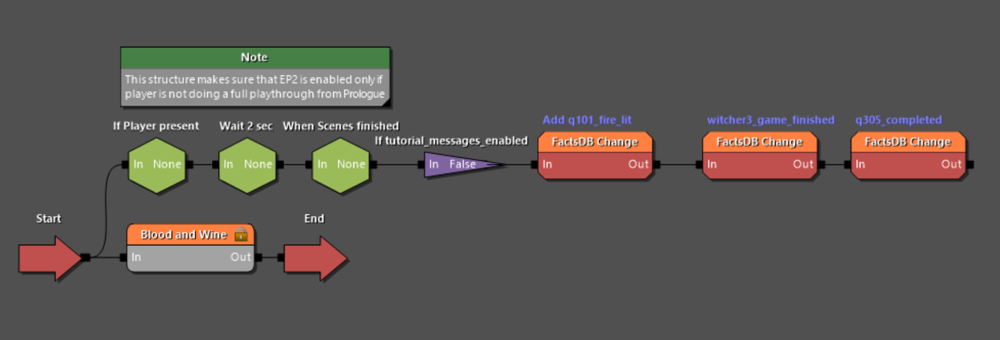
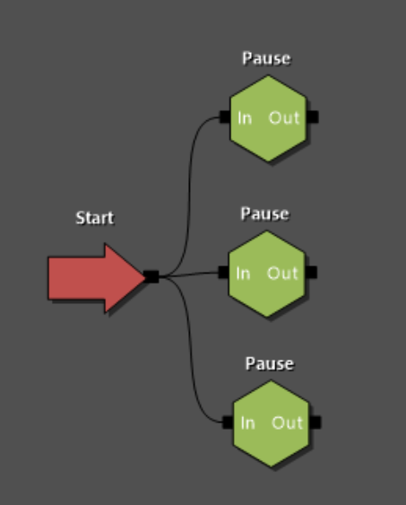

# Основное понятие квеста (Quest)
В отличии от привычного понятия квеста, **квест** в рамках REDkit это главный элемент обеспечивающий отслеживание состояния игры, тесно связанный с текущим положением игрока в сюжетном повествовании.

Если представить прохождение игры в виде отрезка, то запуск игры это начальная точка на отрезке, а завершение всех сюжетных заданий будет финальной точкой. Таким образом продвижения игрока по сюжету является промежуточными точками на данном отрезке и именно положение в рамках этого пути хранится в файле сохранения в части текущего положения в игре.

Несмотря на то, что сравнение с отрезком позволяет проще понять суть работы **квеста**, реальное построение пути игровых событий гораздо сложнее и больше напоминает математические алгоритмы со своими блоками и правилами соединения.

<figure><figcaption></figcaption></figure>

# Работа с файлами квеста
В зависимости от того какого рода мод вы создаете, вы можете как создать новый файл квеста, так и отредактировать имеющийся. Добавление новых файлов это основной способ создания сюжетных DLS, тогда как редактирование имеющегося, позволит изменить уже имеющееся сюжетные линии и игровые события.

В случае редактирования текущего квеста откройте в Asset Browser файл **"witcher3_quest.w2quest"**, расположенный в папке **"quests"**.

Для добавления файла квеста в ваше DLC создайте в Asset Browser папки (если их еще нет), которые образуют путь **"dlc > *наименование вашего DLC* > data > quests"**. Перейдя в конечную папку нажмите правой кнопкой мыши по пустому пространству и контекстном меню выберите **"Create > Quest"**. В качества имени файла рекомендовано использовать **"*имяDLC*_quest.w2quest"**.


*Имена папок, путь к ним, а так же имя файла не является строгим требованием, однако такая структура и именование соответствует текущим DLC к игре и опирается на заложенное поведение REDkit при определенных действиях с проектом.*



*У вас не может быть более одного файла квеста в рамках одной самостоятельной части игры, но каждый отдельный файл может выполнятся параллельно с другими, что позволяет интегрировать ваши DLC в основную сюжетную арку.
Например события дополнения **"Кровь и вино"** могут происходить до окончания основной сюжетной линии, как бы параллельно с ними.*


# Принцип работы квеста
Файл квеста на уровне работы с ним в REDkit это визуальный конструктор графов, что позволяет работать с ним без знаний программирования при минимальном понимании алгоритмов.

Когда вы откроете вновь созданный файл, то увидите пустое поле не содержащее никаких элементов. 
Для добавления новых элементов, нажмите на пустое поле правой кнопкой мыши и в открывшемся меню, выберете интересующий вас блок. Меню элементов редактора квестов содержит множество разных блоков от простейших логических поведений до вызова сложных скриптов, каждый из которых не имеет никакой ценности, пока не будет связан с остальными в единую цепочку.

После добавления блока, вы увидите одну (или более) черные точки по его краям. Это шлюзы для соединения блоков между собой и, зажав ЛКМ на такую точку вы сможете провести линию, которая соединится с такой же точкой на другом блоке.
Вы не ограничены в количестве исходящих и входящих соединений, а так же в направлении пути, но созданные пути должны иметь алгоритмическую структур и исключать замкнутые бесконечные циклы и самовызовы.

Для понимания работы соединений стоит рассмотреть такое понятие как **"Луч"**.

## Луч (положение игры на графе квеста)
Важнейшим элементом в понимании работы **квеста** является правильное представление о том, как именно вызываются блоки в рамках алгоритма квеста.

Лучше всего глядя на файл квеста представить что в начальный блок посылается луч света, который проходя через блок выполняет заложенную в нем функцию и распространяется дальше по всем линиям, что исходят из текущего блока.

Если же на пути луча встречаются блоки ожидания, такие как например **"Пауза (Pause)"**, луч замирает до тех пор пока условие внутри блока не выполнится и шлюз выхода не будет открыт.

Вторым важным аспектов в данном представлении является понимание, что луч, пройдя какой либо блок не возвращается в него, так как его путь всегда направлен вперед по графу квеста.
Это важно, потому что если вам необходимо повторяющееся поведение, вы должны убедится, что у вас присутствует соединение возвращающее луч назад.

<figure><figcaption></figcaption></figure>

Так же не забывайте, что распространяясь по ветвям соединений луч как бы множится для каждого нового пути и его поведение будет зависеть от ожидающих его блоков.
Например если луч исходя из одной точки расходится к трем разным блокам **"Пауза (Pause)"**, каждое выполнение будет продолжено, когда условия конкретного блока будут выполнены и тогда как один из путей, может уйти на множество блоков вперед, другой все еще будет ждать открытие своего шлюза.


*В процессе игры существует множество условий влияющих на течение сюжета. В каждый такой момент луч квеста замирает у советующих блоков до тех пор, пока условия для открытия шлюза не выполнятся.
Такой подход позволяет легко сохранить состояние игрового процесса, записывая в файл сохранение текущее положение луча (лучей).*


## Фаза (Phase)
Как уже можно было понять из вышесказанного, структура файла квеста может быть довольно сложной и запутанной, поэтому разработчики REDkit добавили возможность структурировать ваш квест, разделяя его на более мелки **фазы**.

**Фаза (Phase)** это отдельный файл формата **.w2phase**, который имеет тот же принцип работы, что и у файла квеста но в отличии от него, фазы можно добавлять внутрь квеста и других фаз. В простом представлении фаза это папка, в которой упорядочена часть логики и которую можно поместить в другую папку, создавая структуру любой глубины.

Так как фаза является папкой (группировкой) для других блоков, она так же соединяется с другим блоками и луч (см. выше), попадая в фазу переходит внутрь и проходит все имеющие пути, согласно условиям блоков. 
После прохождения всех путей луч покидает фазу и продолжает путь по соединениям после нее.

## Начало квеста
Как и любой алгоритм, квест должен иметь точку входа с которой начнется его выполнение. Такой точкой входа является элемент **Start**, добавляемый через контекстное меню **"Complexity management > Start"**. 

Обычно в основном файле квеста **.w2quest** не располагается большое число блоков, поэтому наиболее вероятно, что следующим блоком после **Start** будет блок фазы, в которой расположится общая структура вашего сюжета.

Фаза, так же как и квест должна иметь точку входа с которой начнется ее выполнение, только в случае с фазой это будет не блок **Start** а блок **In**.

# Дальнейшие действия
После начального ознакомления с понятием **квеста**, стоит перейти к более подробному рассмотрению работы с квестами, а именно:

- [Работа с редактором квестов](../quests/editor.md)
- [Описание блоков](../quests/nodes.md)
- [Добавление квеста в проект DLC](../quests/dlc_quest.md)